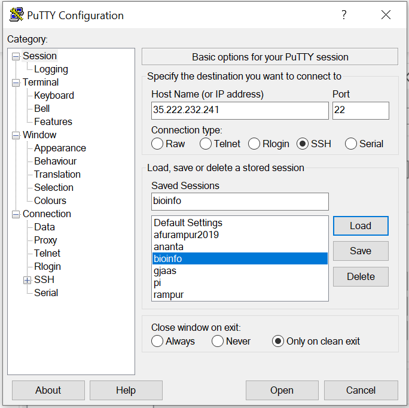
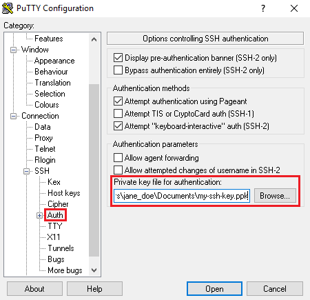

############
Preparing environment and installing tools
############

We will be setting up the computing environment in Google Compute. Other cloud services such as Azure or AWS can also be set up.
For the purpose of this class we have set up with minimal compute resource and storage. For most bioinformatics projects, the resources may not be enough. We can always expand if we need to, thanks to the cloud. 

 
Start Google cloud compute engine
 
Connecting to Google Compute
============================
Linux/Macbook: Terminal

Windows: use putty 

Putty: Please download putty from https://www.chiark.greenend.org.uk/~sgtatham/putty/latest.html. Make sure you have the right version. The host address, password and key file will be shared differently. 

-Open PuTTY by launching putty.exe. A connection configuration window opens.

-In the Host Name field in the connection configuration page, enter the external IP address of the instance that you want to connect to.

-For example, see the following screenshot:

-In the Category menu on the left, navigate to Connection > SSH > Auth.

-In the Private key file for authentication field, browse to the location of your private key file.

-For example, see the following screenshot:

-Go back to Session, give name "bioinfo" for saved session and click save.

-Click Open to open a terminal with a connection to your instance.

-Now, you can always used that saved session to Load/double-click to connect.

-After connecting, run commands on your instance using this terminal. When you have finished using the instance, disconnect from it by using the exit command.

For file transfer:
==================
Winscp: https://winscp.net/eng/index.php

Preparing the environment
=========================

suggest Conda environment for easy install

Install miniconda
=================

 ``wget https://repo.anaconda.com/miniconda/Miniconda3-latest-Linux-x86_64.sh``
 ``bash Miniconda3-latest-Linux-x86_64.sh``

 ``conda config --add channels bioconda``
 ``conda config --add channels conda-forge``

 ``source /home/ananta/.bashrc``

Install Bioinformatics softwares
================================

blast, bwa, samtools, vcftools, 
 
 ``conda install``

activate conda for individiual users:
=====================================
use this or add it on bashrc

 ``. "/home/ananta/miniconda3/etc/profile.d/conda.sh"``
 ``conda activate base``
 

